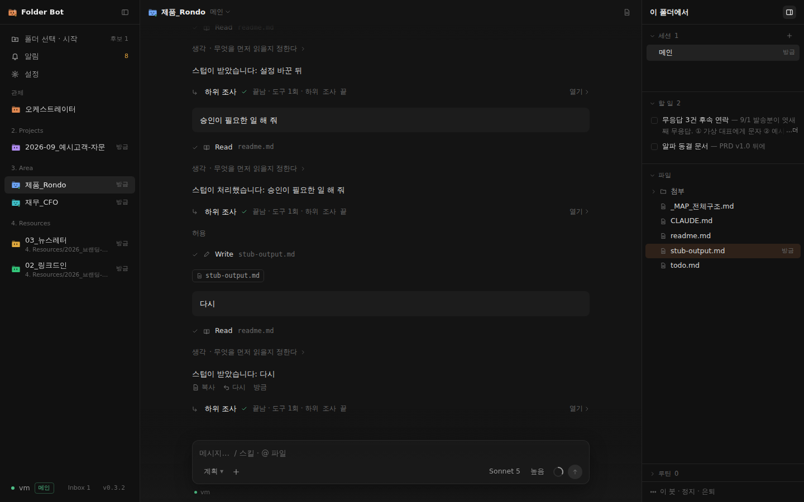
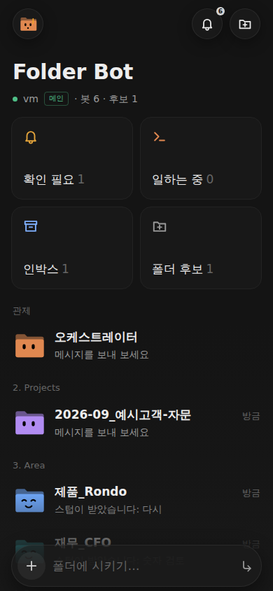
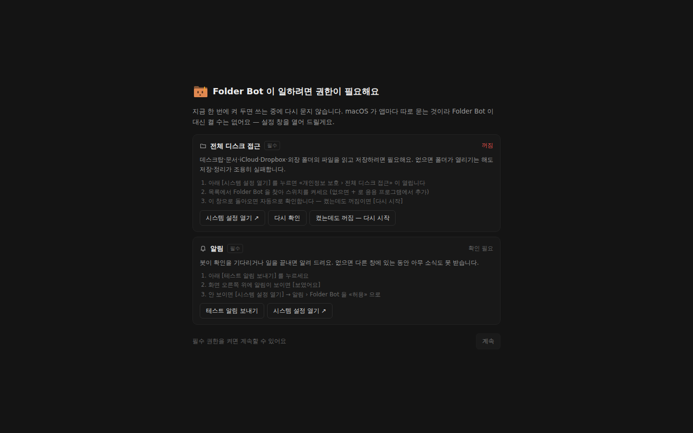
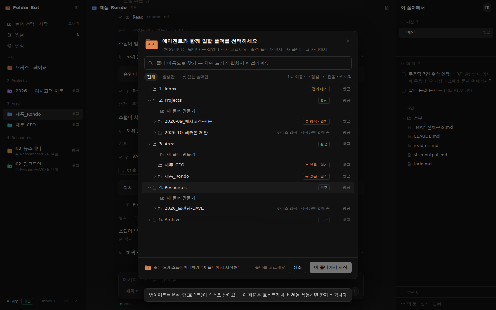

# Folder Bot

**폴더마다 AI 동료 하나.** 내 Mac 위의 폴더(프로젝트·영역·자료)에 Claude Code 에이전트를 하나씩 붙이고, 맥북과 아이폰 어디서든 메신저처럼 시킵니다. 오케스트레이터 봇이 인박스를 정리하고 어느 폴더에 봇을 둘지 제안합니다.

> *A folder-native AI teammate for people who work in folders, not repos.* Runs on your own Mac (host), reachable from your laptop and phone.

<p align="center"></p>

<p align="center">&nbsp;&nbsp;</p>

---

## 무엇이 다른가

| | 코딩 에이전트(Cursor·Claude Code 터미널) | **Folder Bot** |
|---|---|---|
| 단위 | 리포지토리 | **폴더** — PARA(Inbox/Projects/Area/Resources/Archive) 같은 일하는 사람의 폴더 |
| 컨텍스트 | 코드 | 그 폴더의 `CLAUDE.md`(지침) · `todo.md`(할 일) · 자료 |
| 어디서 | 그 컴퓨터 앞에서 | **아이폰에서도** — 홈 화면 앱, 푸시 알림, 승인 카드 |
| 여러 개 | 탭 | 봇마다 세션, 오케스트레이터가 인박스·후보 폴더를 관제 |

- **봇 = 폴더 + 에이전트.** 폴더를 고르면 `CLAUDE.md`·`todo.md` 를 깔고 Claude Code 세션을 붙입니다. 파일을 읽고 쓰고, 정리하고, 문서를 만듭니다.
- **오케스트레이터.** 볼트 루트에 사는 봇. 인박스에 넣어 둔 파일·폴더를 규칙대로 옮기자고 제안하고(승인 뒤 실행, 되돌리기 가능), 다른 봇에게 일을 넘깁니다.
- **원격 우선.** 호스트(Mac mini 등)가 봇을 돌리고, 맥북·아이폰은 같은 화면을 봅니다. 승인이 필요하면 알림이 오고, 답이 끝나면 알려 줍니다.
- **투명한 실행.** 어떤 도구를 몇 번 썼는지, 서브에이전트가 무엇을 하는지 한 줄씩 보입니다 — 답변은 크게, 실행 줄은 작게.

## 설치 (5분)

요구 사항: **Apple Silicon Mac** (호스트) · [Claude Code CLI](https://claude.ai/code) 로그인(Claude 구독 또는 API 키) · 아이폰/맥북은 같은 [Tailscale](https://tailscale.com) 네트워크(권장)

1. [Releases](https://github.com/dave-jin/folderbot/releases) 에서 최신 `Folder.Bot-<버전>-arm64.dmg` 를 받아 **Applications** 로 끌어 놓습니다.
2. 처음 열 때 «확인되지 않은 개발자/손상됨» 이 뜨면(개발자 인증서 없이 ad-hoc 서명이라서) 터미널에 한 줄:
   ```
   xattr -dr com.apple.quarantine "/Applications/Folder Bot.app"
   ```
3. 앱을 열고 **이 맥에서 호스트 실행** → 볼트 폴더(예: PARA 루트)를 고릅니다. 오케스트레이터가 첫 인사를 합니다.
4. 처음 한 번 **권한 화면**이 뜹니다 — 전체 디스크 접근(Dropbox·문서·데스크탑 폴더를 읽고 저장), 알림(승인 요청·완료 알림). 시스템 설정을 열어 켜고 돌아오면 자동으로 확인합니다.

<p align="center"></p>

5. **맥북**에서는 같은 앱을 설치하고 호스트 주소와 페어링 코드를 넣습니다. **아이폰**은 Safari 로 호스트 주소를 열고 «홈 화면에 추가» — 앱처럼 실행되고 푸시를 받습니다.

자세한 절차와 문제 해결: **[docs/INSTALL.md](docs/INSTALL.md)** · 호스트 런북: [docs/RUNBOOK-mini.md](docs/RUNBOOK-mini.md)

## 쓰는 법

- **폴더 선택 · 시작** — PARA 트리를 Finder 처럼 펼쳐 어느 폴더에서든 봇을 시작합니다. 후보(하네스 없는 폴더)는 오케스트레이터가 찾아 둡니다.

  

- **대화** — `/` 로 스킬·명령, `@` 로 파일 참조, Finder 에서 파일을 끌어 첨부. 모델·생각 레벨·권한 모드는 컴포저 아래 한 줄에서 세션마다 바꿉니다.
- **오른쪽 패널** — 이 폴더의 세션 · 할 일(`todo.md`, 제목을 눌러 편집) · 파일 트리(우클릭: 여기서 에이전트 시작 · 이름 바꾸기 · 폴더째 첨부) · 루틴(cron).
- **알림** — 봇이 승인을 기다리거나 일을 끝내면 맥 알림 + 폰 푸시. 알림을 누르면 그 대화로 갑니다.
- **자동 업데이트** — 앱이 이 리포의 릴리스를 30분마다 보고 조용히 받아 둡니다. 세션이 전부 쉬는 순간 «재시작해서 적용» 을 물어봅니다. 왼쪽 아래 버전 칩을 누르면 바로 확인합니다.

## 어떻게 생겼나

```
아이폰(PWA) ─┐                           ┌─ 봇 A (2. Projects/…)  Claude Code 세션
맥북(앱)   ─┼── HTTPS/SSE ──▶ 호스트(Mac) ─┼─ 봇 B (3. Area/…)      Claude Code 세션
호스트 자신 ─┘        (Tailscale)          └─ 오케스트레이터 (볼트 루트) + MCP(봇 간 위임)
```

```
src/core     순수 TS — 타입 · 폴더 규칙 · todo.md 파서 · 스트림 해석 · 상태 머신 (Electron/DOM 의존 없음)
src/host     Node 호스트 — 봇 레지스트리 · Claude 워커(stream-json) · HTTP+SSE 게이트웨이 · MCP 서버 · 루틴 · 푸시
src/client   PWA — 3열 메신저(목록 · 대화 · 이 폴더에서) · 문서 열 · 폴더 선택 · 알림 센터 · 폰 레이아웃
desktop/     Electron 셸 — 호스트 내장 모드 · 원격 클라이언트 · 메뉴바 · 자기 업데이트 · 권한 관문
bin/         folderbot CLI (init · start · status · token)
```

봇의 상태는 볼트 안 `.folderbot/` 에, 대화·설정은 `~/Library/Application Support/Folder Bot/` 에 있습니다. 파일은 사용자의 폴더에 그대로 남습니다 — 데이터베이스가 없습니다.

## 개발

```bash
npm install
npm run qa          # typecheck · unit(vitest) · build · smoke(스텁 CLI + 실제 화면 검사)
npm run build && node bin/folderbot.mjs init <볼트 루트> && node bin/folderbot.mjs start
```

- 실제 `claude` 를 띄우지 않고 검사합니다 — `FOLDERBOT_CLI_BIN=test/fixtures/stub-claude.mjs`.
- 데스크톱 앱은 `desktop/` 에서 `npx electron-builder --mac --arm64`. `main` 에 푸시하면 CI 가 `desktop-v<n>` 릴리스를 만듭니다.
- 기획과 결정 기록: [docs/PRD.md](docs/PRD.md) · 사용 시나리오: [docs/SCENARIOS.md](docs/SCENARIOS.md)

## 상태와 한계

- 초기 버전입니다. macOS Apple Silicon 호스트만 지원하고, 앱은 개발자 인증서 없이 ad-hoc 서명됩니다(첫 실행 시 검역 해제 필요).
- Claude Code CLI 의 headless 출력은 생각(thinking) 본문을 주지 않습니다 — 생각 중임은 상태줄로만 보입니다.
- 한국어 UI 가 기본입니다. 영어는 곧.

## 라이선스

[MIT](LICENSE) — 자유롭게 쓰고 고치고 나누세요. 저작권 표시만 남겨 주시면 됩니다.

만든 사람: [Dave (진대연)](https://github.com/dave-jin) — Claude Code 로 매일 만들고 배포하는 사람. 이 리포 자체도 Claude Code 와 함께 만들어졌습니다.
